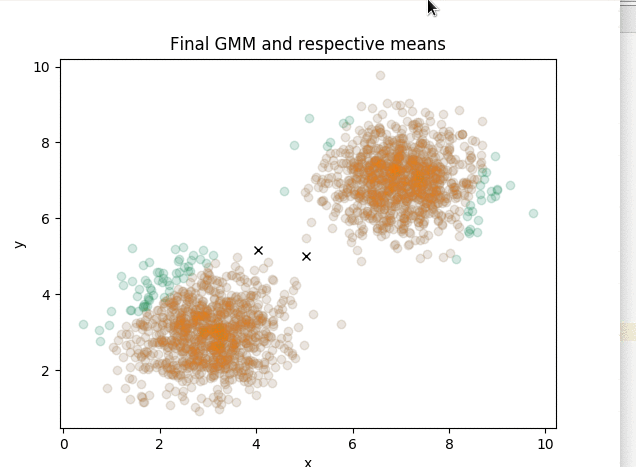
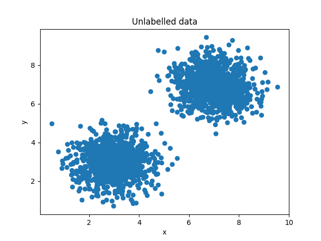
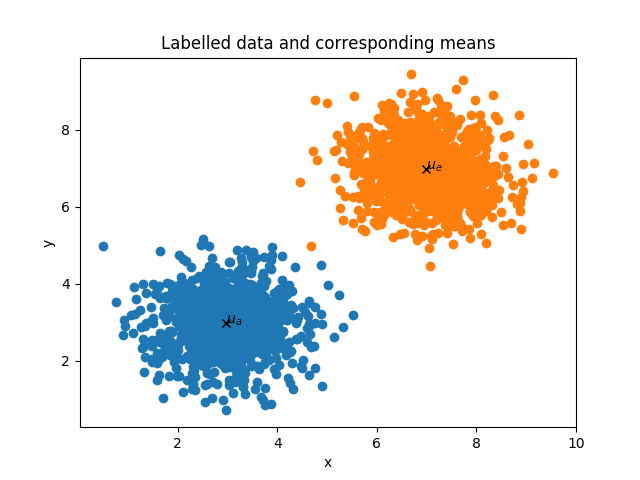
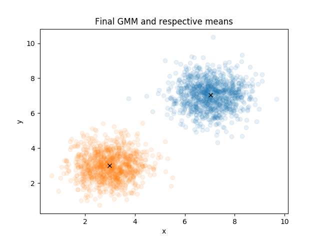
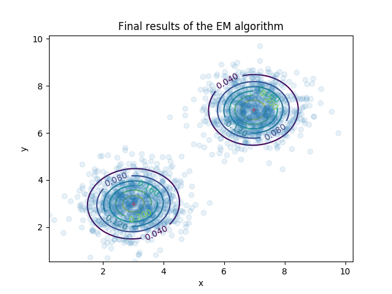
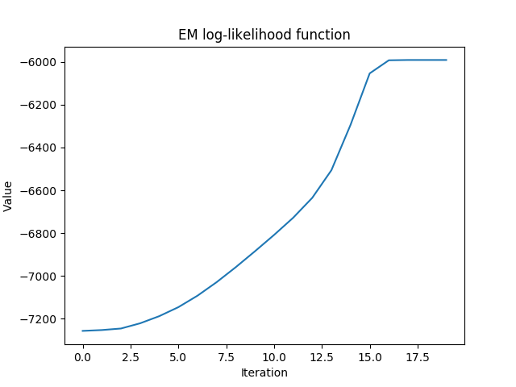
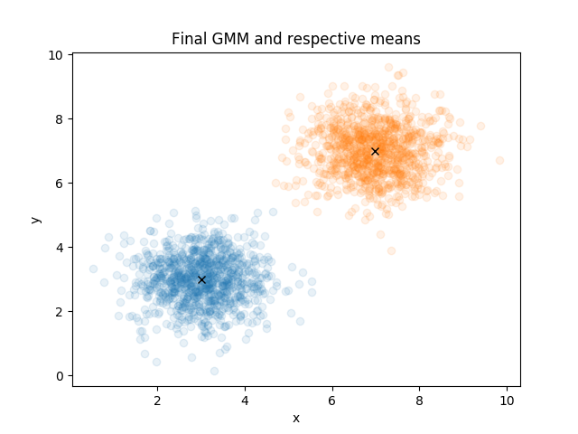
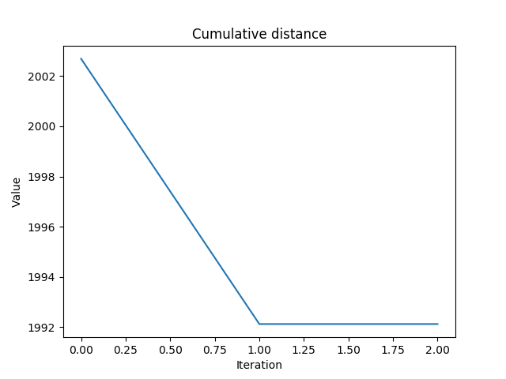
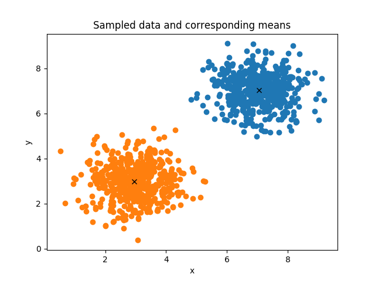

# Clustering
Efficient implementation of the clustering using the Expectation Maximization (EM) and K-means algorithms

## Requirements

- Python 2.7 or Python 3.3
- [scipy](https://github.com/scipy/scipy)
- [numpy](https://github.com/numpy/numpy)

## Usage

To apply the EM algorithm on a dateset one needs to call:

	$  L = gmm.EM(max_iter=max_iter, tol = tol)

To apply the K-means algorithm on a dataset one needs to call:

	$ D = gmm.k_means(max_iter=max_iter, tol=tol)

To sample from an already trained GMM model, one needs to call:

	$ Y = gmm.sample(N=N)

Several examples can be found within the **main.py** file. 

## Sample results

**[1] Results of the EM algorithm over iterations**

## Sample data 

**[1] Unlabelled data**

**[2] Labelled data**

## Results of the EM algorithm

**[1] Final result of the EM algorithm**

**[2] Final result of the EM algorithm (covariance matrices)**

**[3] EM cost function over iterations**

## Results of the K-means algorithm

**[1] Final result of the K-means algorithm**

**[2] K-means cost function over iterations**

## Sampling results

**[1] Sampling results from already trained GMM model**

